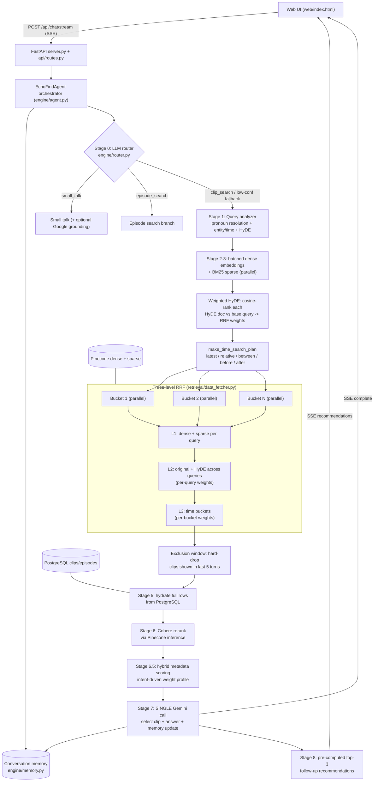

# EchoFind — Design Notes

EchoFind is a memory-aware, conversational RAG engine that returns the single best podcast **clip** (with exact timestamps) or **episode** for a natural-language question. This document leads with the real architecture, then dives into the two pieces of engineering that distinguish it: the **multi-level Reciprocal Rank Fusion (RRF) with weighted HyDE**, and the **single-call select + memory** latency optimization.

## Multi-level RRF with weighted HyDE

**The problem.** A single embedding of the user's question rarely matches the wording of the *best* transcript segment. People ask "what did that founder say about pricing?"; the transcript says "we landed on usage-based billing because…". EchoFind attacks this on three independent axes at once — lexical vs. semantic matching, query phrasing, and time windows — and each axis produces its own ranked list. The challenge is combining lists whose raw scores are not comparable: Pinecone dense cosine scores, BM25 sparse scores, and date-sorted buckets live on different scales, so naive score addition is meaningless.

**The approach.** EchoFind generates HyDE documents (`engine/query_analyzer.py`): short hypothetical podcast transcript snippets, plus person-specific angles (first-person, interview, story) when a guest is named. The resolved query and every HyDE doc are embedded in **one batched OpenAI call** and BM25-encoded in parallel. Crucially, not all HyDE docs are equally trustworthy — a hallucinated tangent should not dominate retrieval. So `_cosine_similarity` scores each HyDE embedding against the base-query embedding, `_rank_hyde_weights` sorts them, and assigns a linearly interpolated weight from `HYDE_WEIGHT_MAX` (1.1) down to `HYDE_WEIGHT_MIN` (0.85); the original query keeps the highest weight, `ORIGINAL_QUERY_WEIGHT` (1.25). HyDE docs closest to the user's intent therefore pull hardest.

Fusion uses one primitive, `rrf_fuse_lists`, applied at three levels. RRF scores each item as `weight * 1/(k + rank)` with `RRF_K = 60` (the SIGIR/Elastic default), which depends only on **rank**, sidestepping the incomparable-scores problem entirely:

1. **Per-query dense+sparse** — inside `concurrent_hybrid_search`, each query's dense and sparse hit lists are fused with `DENSE_RRF_WEIGHT`/`SPARSE_RRF_WEIGHT`, coalescing a `retrieval_source` label ("both" > dense > sparse) so downstream stages know why a chunk surfaced.
2. **Across queries** — `combine_pinecone_results` fuses the original-query list with the HyDE lists using the per-query weights computed above.
3. **Across time buckets** — the same function fuses each bucket's result list using `per_bucket_weights` from `make_time_search_plan` (e.g. a tight recency bucket weighted 2.0, a backstop "all" bucket weighted 0.3).

Buckets run concurrently via `asyncio.gather`, and after fusion an episode-cap / min-per-bucket quota (`enforce_episode_cap_and_bucket_quota`) preserves diversity so one chatty episode can't monopolize the candidate set.

**The trade-off.** RRF is deliberately score-agnostic: it throws away the *magnitude* of similarity and keeps only ordinal rank. That makes the three heterogeneous signals safely combinable and robust to scale drift, but it cannot express "this dense hit is *vastly* better than everything else." EchoFind accepts that loss on purpose, then recovers magnitude-sensitivity later, where it is cheap and controllable: Cohere reranking re-scores survivors against the query, and `apply_hybrid_metadata_scoring` applies an intent-driven weighted blend of semantic + date + person + show signals. Rank fusion maximizes *recall* of plausible candidates; the rerank-and-rescore tail restores *precision*.

## Single-call select + memory

**The problem.** Two LLM steps sit at the end of every clip query: pick the winning chunk and write the user-facing answer, and update the conversation memory (summary, entities, themes, notable examples) so the next turn can resolve "what else did *he* say?". Done sequentially, that is two round-trips and ~1–2 s of avoidable latency on the user's critical path.

**The approach.** `select_and_update_memory` (`engine/selection.py`) fuses both into **one** Gemini call. A PTCF-structured prompt presents candidates as XML `<document>` blocks and asks the model — via the `SelectionWithMemoryOutput` Pydantic schema — to first extract supporting quotes, then emit `chosen_index`, `answer`, `confidence`, **and** the full memory payload together. Reliability comes from a robustness ladder: structured output (`beta.chat.completions.parse`) first; on `AttributeError`, `json_object` mode; and if that JSON is malformed, a hand-written repairer (`_repair_json` + `_fix_unescaped_quotes_in_strings`, a character state machine that escapes stray interior quotes). Every layer has a typed fallback so the pipeline never hard-fails.

**The trade-off.** Folding selection and memory into one call couples two concerns: a memory-extraction bug can perturb the selection prompt, and the schema is larger. EchoFind judges the latency win and the guarantee that memory always reflects the *actually chosen* clip worth that coupling — recommendations are then pre-computed and cached so a follow-up tap resolves with no further model call.
